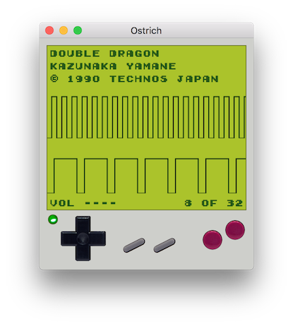
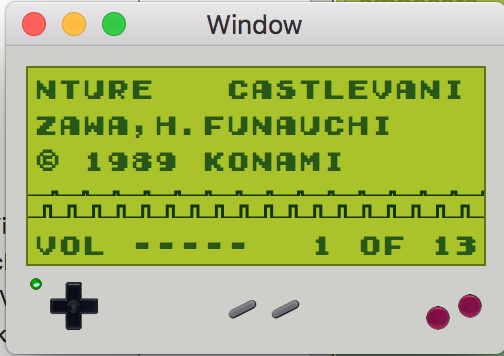

# Ostrich #

Ostrich is a Game Boy Sound System player written in Swift. Under the covers, it is a Nintendo Game Boy emulator.

## Usage ##

To use Ostrich, open it and load a GBS file (typically with extension .gbs) using File -> Open. If the file is loaded successfully, its game name, composers, and copyright owner will be displayed on screen and Ostrich will be ready for playback.

To start playback, press the rightmost, "A" button. The status LED on the left side of the screen should turn from red to green, reflecting the playback status. To pause playback, press the "A" button again. The status LED will turn yellow, and playback can be resumed at any time with the "A" button.

To stop playback, press the second from the right, "B" button. To play the next or previous track, press right or left on the d-pad sitting at the left side of the window. The currently-playing track is displayed at the bottom-right of the Game Boy screen.

To increase or decrease the volume, press up or down on the d-pad. The volume is displayed at the bottom-left of the Game Boy screen.

To toggle the muting of either pulse wave channel, press either grey button - the left one for Pulse 1 and the right one for Pulse 2. Muted channels will be displayed with dimmed waveforms.

Note that Ostrich may be resized for your viewing pleasure.

## Building ##

Ostrich is programmed in Swift 3 using Xcode 8 and depends on AudioKit 3. It requires macOS 10.11 (El Capitan) or newer.

To build Ostrich:

1. Grab the latest AudioKit macOS release (most recently tested: 3.5)
1. Open the Ostrich workspace, ostrich.xcworkspace, in Xcode
1. Install the AudioKit framework to both the gameboy and gbsplayer Xcode projects as described in [the AudioKit guide](https://github.com/audiokit/AudioKit/blob/master/Frameworks/INSTALL.md)
1. Build the gameboy project
1. Build the gbsplayer project
1. Run the gbsplayer project

## Technical Details ##

todo

note only pulse channels supported

note audiokit

Ostrich implements elements of the Game Boy necessary to reproduce its audio output. This is primarily its CPU, the Z80-like Sharp LR35902.

## Author ##

Ostrich is written entirely by myself, [Ryan Conway](http://www.rmconway.com/). It would not have been possible without the help of [Austin Zheng](http://austinzheng.com/) and the documentation of Game Boy hardware written by many and available online. Some of this documentation is captured in [resources.txt](resources.txt).

## License ##

Ostrich is copyright 2016-2017 Ryan Conway. Its source code is released under the MIT license; see [LICENSE.txt](LICENSE.txt).

Ostrich uses resources produced by others and made available under the terms of different licenses:
* Game Boy input images adapted from photograph by William Warby (https://www.flickr.com/photos/wwarby/), licensed under a Creative Commons Attribution Generic license (https://creativecommons.org/licenses/by/2.0/).

* The FontStruction “GameBoy Super Mario Land” (http://fontstruct.com/fontstructions/show/727186) by “nsun” is licensed under a Creative Commons Attribution Non-commercial license (http://creativecommons.org/licenses/by-nc/3.0/).